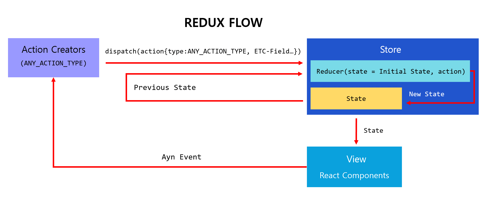

## 📕 프로젝트 개요(Introduce Project)

### Learn-Redux

* 리덕스(Redux) 사용법을 알아보고 리액트(React)와 함께 이용해보는 프로젝트 입니다.

## 🏷️ 기능(Function)

1. [Counter](#Counter)
2. [To Do List](#To-Do-List)

## 💡 사용법(Tip)

### 리덕스(Redux) 키워드

### 액션(Action)

* 상태(State)에 어떤 변화가 필요할 때 발생시키는 역할을 합니다.
* `type` 필드(Field)는 필수 입니다.
* `type` 필드(Field)가 존재한다면 어떤 필드가 있어도 상관없습니다.

```javascript
export const set = () => ({ type: SET });
export const fit = () => ({ type: FIT, id: 'Fit ID' });
```

### 액션 생성 함수(Action Creator)

* 매개 변수(Parameter)를 받아서 액션 객체 타입으로 만듭니다.
* 컴포넌트(Component)에서 더 쉽게 액션을 발생시키기 위해 사용합니다.

### 리듀서(Reducer)

* 변화를 일으키는 함수로써 현재 상태(State), 전달 받은 액션(Action)을 매개 변수(Parameter)로 받습니다.
* 일치하는 액션(Action)이 없을 경우 디폴트(default)로 현재 상태를 그대로 반환합니다.

```javascript
export default function counter(state = initialState, action) {
  switch (action.type) {
    case SET_DIFF:
      return {
        ...state,
        diff: action.diff,
      };
    case INCREASE:
      return {
        ...state,
        number: state.number + state.diff,
      };
    case DECREASE:
      return {
        ...state,
        number: state.number - state.diff,
      };

    default:
      return state;
  }
}
```

### 스토어(Store)

* 복잡성 때문에 애플리케이션 당 한 개의 스토어만 만들 것을 권장하고 있습니다.
* 현재 애플리에션 상태, 리듀서(Reducer), 스토어 내장 함수가 포함되어있습니다.

#### 스토어(Store) - 디스패치(Dispatch)

* 스토어(Store) 내장 함수 중 하나로 `액션(Action)을 발생시키는 것` 이라 생각하면 됩니다.
* `dispatch` 함수는 액션(Action)을 인자(Argument)로 받아 매개 변수(Prameter)로 전달합니다.

``` javascript
  const onIncrease = () => dispatch(increase());
  const onDecrease = () => dispatch(decrease());
  const onSetDiff = (diff) => dispatch(setDiff(diff));
```

#### 스토어(Store) - 구독(Subscribe)

* 스토어(Store) 내장 함수 중 하나로 함수 형태의 값을 매개 변수(Prameter)로 받습니다.
* 리액트(React)에서 사용할때는 `react-redux` 라이브러리에서 제공하는 `connect` 함수 또는 `useSelector` `Hook` 을 사용하여 리덕스 스토어의 상태에 구독합니다.

## 💻 개발 환경(Develop Environment)

### 세부 환경(Environment Detail)

||운영체제(OS)|언어(Language)|프레임워크(Framework)|
|-|:-:|:-:|:-:|
|명칭(Name)||||
|버전(Version)|`10`, `11`||`18.2.0`|

## 📖 비고(Remark)

### 리덕스(Redux) 3가지 규칙

#### 1. 하나의 애플리케이션 안에는 하나의 스토어를 가져야 합니다

* 필수는 아니지만 권장하지 않습니다.
* 개발 도구 활용할 수 없게 됩니다.

#### 2. 상태(State)는 읽기 전용 입니다

* 리액트(React)에서 `state`를 업데이트 할 때 `setState`를 사용하고, 배열을 업데이트 할 때 `concat` 과 비슷한 함수로 새로운 배열로 교체하는 방식으로 업데이트 합니다.

* 리덕스(Redux)에서 새로운 상태로 생성하여 업데이트하는 방식을 사용하면 개발자 도구에서 `다시하기 : Undo, 되돌리기 : Redo` 가 가능합니다.

* 리덕스(Redux)에서 내부적으로 데이터가 변경 되는 것을 감지하기 위해 `shallow equality` 검사를 하므로 불변성을 유지해야 합니다.

#### 3. 변화를 일으키는 함수 , 순수(원래 그대로)한 함수여야 합니다

* 리듀서 함수는 이전 상태와, 액션 객체를 매개 변수(Parameter)로 받습니다.
* 이전 상태(State)는 건들이지 않고, 변화를 일으킨 새로운 상태(State) 객체를 만들어 반환해야 합니다.
* 똑같은 매개 변수로 호출된 리듀서 함수는 언제나 똑같은 결과값을 반환해야만 합니다.
  * 실행할때마다 다른 결과값 : `new Date()`, 랜덤 숫자 생성, 네트워크 요청
  * 리듀서(Reducer) 밖에서 처리해야하므로 리덕스 미들웨어(Redux-Saga, Redux-thunk...)가 필요합니다.

### 리덕스 플로우(Redux Flow)

